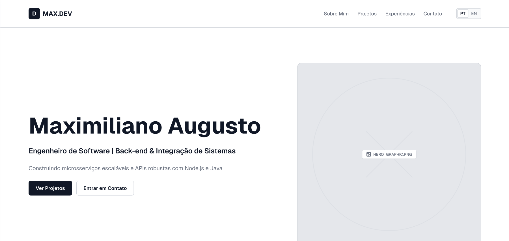
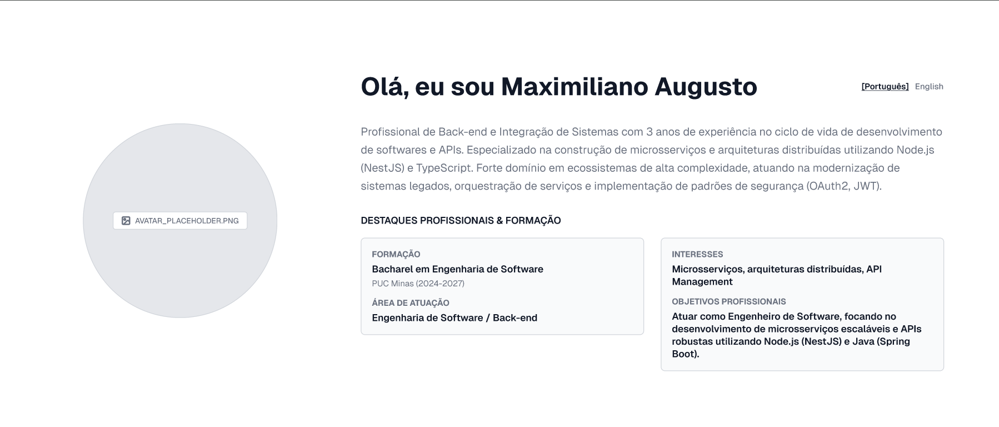
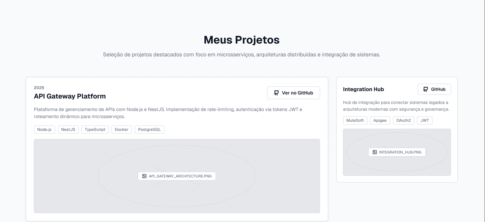
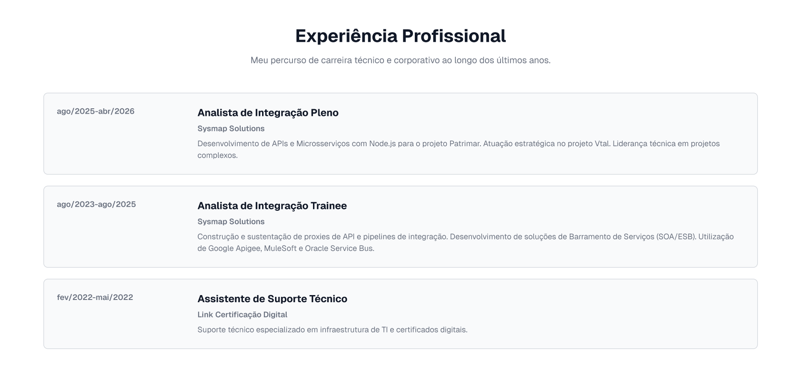
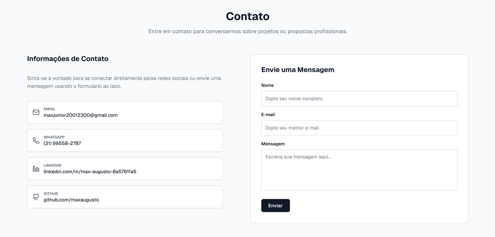

# 💼 Portfólio Profissional

> Projeto desenvolvido na disciplina de **Laboratório de Desenvolvimento de Software** com o objetivo de apresentar projetos, trajetória técnica, competências e canais de contato de forma moderna, interativa e responsiva.

---

## 📌 Sobre o Projeto

Este projeto consiste em um portfólio profissional completo projetado para consolidar experiências práticas de desenvolvimento full stack, boas práticas de engenharia de software e integração de serviços modernos. A aplicação conta com navegação fluida, visualização de cases/projetos desenvolvidos e canal de comunicação direto via formulário de contato integrado.

---

## 🖼️ Protótipo & Telas do Projeto

Abaixo estão dispostos os wireframes e telas do protótipo desenvolvido:

| Wireframe 1 | Wireframe 2 |
| :---: | :---: |
|  |  |

| Wireframe 3 | Wireframe 4 |
| :---: | :---: |
|  |  |

| Wireframe 5 |
| :---: |
|  |

---

## 🚀 Tecnologias Previstas

A arquitetura do projeto foi planejada utilizando tecnologias consolidadas no ecossistema web moderno:

- **Frontend:**
  - [React](https://react.dev/) – Biblioteca para construção de interfaces reativas e modulares.
  - [Vite](https://vitejs.dev/) – Build tool e bundler rápido para desenvolvimento ágil e otimização de build.

- **Backend:**
  - [NestJS](https://nestjs.com/) – Framework progressivo em Node.js com arquitetura modular, escalável e tipagem com TypeScript.

- **Serviços & Integrações:**
  - [EmailJS](https://www.emailjs.com/) – API para envio simplificado e seguro de mensagens diretamente pelo formulário de contato.

---

## ⚙️ Como Executar o Projeto

# 1. Clone o repositório
git clone [Repositorio](https://github.com/MaxJunior2002/Portifolio).

# 2. Acesse a pasta do projeto
cd portfolio-profissional

# 3. Instale as dependências (Frontend)
cd meu-portfolio
npm install
npm run dev
